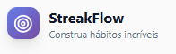

# 👋 Olá, eu sou João Gabriel

  

🎮 Desenvolvedor FullStack & Criador de Jogos
💡 Apaixonado por experiências interativas, sistemas criativos e projetos autorais

> *Boas-vindas ao meu mundo digital.*

---

## 🌌 Sobre mim

Sou um desenvolvedor focado na criação de aplicações interativas, jogos e sistemas com identidade própria.
Gosto de transformar ideias criativas em projetos funcionais, especialmente aqueles que envolvem lógica, narrativa e experiência do usuário.

Atualmente exploro:

* Desenvolvimento de jogos (Godot & lógica de sistemas)
* Aplicações web interativas
* Projetos pessoais com propósito criativo
* Sistemas organizacionais e experimentais (como apps de rotina e lógica procedural)

Minha abordagem une **criatividade + lógica + identidade autoral**.

---

## 🧠 Tecnologias

### 💻 Linguagens & Desenvolvimento

  
  
  
  
  
  

### ⚙️ Ferramentas & Infraestrutura

  
  
  
  

---

## 🎯 Áreas de Interesse

* 🎮 Game Development (Godot, sistemas de gameplay)
* 🧩 Aplicações interativas e experimentais
* 🐍 Projetos em Python e lógica de sistemas
* 🌐 Sites, ferramentas web e mini projetos criativos
* 📊 Sistemas de produtividade e organização pessoal

---

## 🛠 Projetos em Destaque  

| Projeto | Visual | Descrição |
|--------|--------|-----------|
| 🧙‍♂️ Polarized Forge | 

 | Plataforma web complexa para sessões de RPG online em tempo real. Possui backend estruturado, banco de dados dedicado, sistema próprio de ficha, eventos em tempo real via WebSockets e arquitetura escalável. Em evolução para se tornar um VTT (Virtual Tabletop) completo. |
| 🌸 Blue Witch in Bloom | 

 | Jogo de plataforma 2D autoral desenvolvido na Godot Engine, com combate mágico, bosses únicos, sistema de progressão por coletáveis e forte direção estética em pixel art. |
| 🏰 Oakhaven | 

 | Projeto de jogo narrativo focado em construção de mundo, sistemas interativos e design de experiência, com identidade própria e abordagem autoral de storytelling. |
| 🎲 MyRoutine | 

 | Aplicativo de organização pessoal com geração procedural de rotina semanal, filtros por tipo de atividade, sistema de streak, objetivos e análise de performance. |
| 🔥 Streakflow | 

 | Aplicação de produtividade gamificada focada em consistência, acompanhamento de hábitos e métricas de desempenho ao longo do tempo. |
| 🖱 ClickSite | 

 | Sistema de templates para criação rápida de sites e landing pages personalizáveis, com foco em praticidade e reutilização de layouts. |

---

## 📚 Conhecimentos

* Desenvolvimento de Software
* Lógica de Programação
* Front-end moderno (React & JS)
* Técnico em Redes e Infraestrutura
* Arquitetura de projetos pessoais
* Game Design e sistemas narrativos

---

## 🚀 Foco Atual

Atualmente estou focado em:

* Desenvolvimento do meu jogo autoral
* Projetos web com identidade própria
* Sistemas gamificados (rotina, performance, lógica procedural)
* Evolução como desenvolvedor full stack criativo

---

## 🌠 Filosofia de Desenvolvimento

Gosto de criar projetos que não sejam apenas funcionais, mas que tenham:

* Identidade
* Sistema próprio
* Lógica bem pensada
* Valor criativo a longo prazo

Não apenas código, mas **mundos, sistemas e experiências**.

---

## 📊 Estatísticas

  
  

  

---

### ✨ *Obrigado por visitar meu perfil!*
> “Criatividade é a minha melhor característica”
